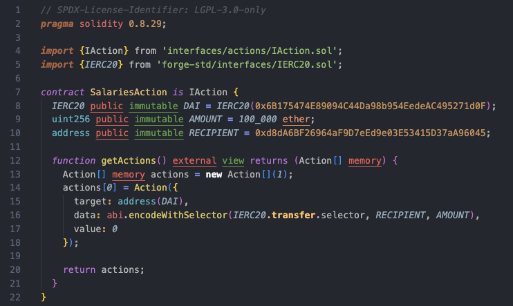

# Canon Guard

## Overview

The objective of Canon Guard is to improve the security of the multi-sig account, specifically designed for Gnosis SAFE multi-sig, although a similar logic could be applied for other types. The main pain-points (from a security perspective) to improve are:

- **Off-chain dependencies**: Gnosis flow relies strongly on their backend DB in order to coordinate the collection and storage of off-chain signatures, in order to display to the Signer the activity of the other Signers, to know if the action is ready to be executed or not.
- **5-dollar-wrench attack vector**: Such a security setup cannot be vulnerable to inexpensive (although violent and illegal) attacks. The multi-sig should be secured even in the event of 3-out-of-3 Signers being deprived of liberty (aka. kidnapped).
- **Signer Fatigue**: Even the most meticulous signers will eventually experience review fatigue from repeatedly checking the same multisig transactions, potentially overlooking critical details.

## Fundamental security assumptions

- Using a UI hosted on an external server means relying entirely on it not being hacked.
- Even extremely cautious multisig signers can still get hacked.
- A "$5 wrench attack" (physical threats or coercion) is a genuine risk and should be considered when designing secure processes.
- Even the most meticulous signers will eventually experience review fatigue from repeatedly checking the same multisig transactions, potentially overlooking critical details.

## Core principles for Canon Guard

- **Minimize repetitive approvals**: Recurring transactions should only require thorough verification once, rather than repeatedly.
- **Timelocks on all transactions**:
    - Pre-approved or routine transactions can go through a short timelock
    - New, unusual, or higher-risk transactions must face a longer timelock to allow cancellation.
- **Prohibit `DELEGATECALL`**: This opcode introduces critical security risks and should be categorically disallowed.
- **Eliminate external dependencies**: The Signers flow should rely solely on the blockchain—no off-chain trust or external services.
- **Everything on-chain**:
    - Approvals must be done via on-chain transactions only.
    - Simulations and safety checks should depend purely on on-chain data, requiring zero off-chain inputs.
- **Resilience under coercion**: Even in extreme scenarios (e.g., all signers compromised simultaneously), it should still be impossible to immediately drain the Safe.
- **Emergency mode**:
    - In case of an emergency, the Safe could be set in emergency mode by the allowed address (most probably a 1/x multisig)
    - When in emergency mode, the emergency signer will be required to also sign any transaction for its execution (the emergency signer will most probably be a 4/7 multisig or similar).
    - In case most signers of the Safe get compromised, this would allow the rotation of signers.

## A Safer Execution Model for Multisigs

Organizations that rely on multisigs often execute recurring transactions—such as salary disbursements or vesting fund claims. Each transaction proposal and signature introduces a surface for potential exploitation. The goal of this solution is to significantly reduce that risk.

This approach draws inspiration from the *spells* architecture used by Sky (formerly MakerDAO) and Spark, additionally avoiding the use of `DELEGATECALL` that requires extreme carefulness on each call, because of the risk of changing the contract storage (catastrophic).

At the core of this system is the concept of Actions: Solidity smart contracts that encapsulate all the necessary transaction logic and parameters. These Actions are designed to be:

**Simple** – Focused and easy to reason about.

**Immutable** – Once deployed, they cannot be altered.

**Independent** – Self-contained, with no external dependencies.

**On-chain** – Fully deployed to the blockchain for transparency and auditability.

To ensure security and reliability, all Actions should undergo thorough auditing prior to use.

> 
> 💡
>
>Here’s an example of a simple Action, transferring 100,000 DAI to `vitalik.eth`:
>
> 

Deploying an **Action**—a small, immutable smart contract—for recurring transactions ensures that it only needs to be carefully reviewed once. Once vetted, the same Action can be safely reused and queued in the Safe without requiring repeated in-depth scrutiny.

To manage these Actions, we introduce an **Entrypoint** contract. This contract maintains a queue of Actions and tracks which Action addresses have been pre-approved, for a specific time period (e.g. “pre-approve an action for a year”).

Organizations should aim to define all recurring or routine operations as on-chain Actions, clearly separating them from ad-hoc or sensitive transactions:

- **Pre-vetted Actions**:
    - Pass through a **short timelock** (e.g., 1 hour).
    - Do **not** require detailed signer review each time they're queued.
    - Examples include regular salary payments or token vesting claims.
    - Pre-approved for a limited time period.
- **Irregular Transactions**:
    - Pass through a **long timelock** (e.g., 1 week).
    - Should trigger alerts from monitoring tools when queued.
    - Require full, manual reviews by signers to detect potential malicious behavior.
    - **Adding a new Action to the pre-vetted list** is itself considered an irregular transaction.
    - Best practice is to **minimize** the number and frequency of irregular transactions.

### Enhancing Safety with a Custom Safe Guard

To enforce strict transaction boundaries, a custom Safe Guard contract should be deployed to:

- Block all **off-chain signatures**.
- Allow only calls from the **Entrypoint**.
- Reject all `DELEGATECALL` operations, **except** those to `multiSend`.

### Transparent and Simulatable

Because both Actions and the queue are stored entirely **on-chain**, tools like Tenderly can be used to simulate transaction behavior without needing any off-chain inputs. This allows signers and observers to preview exactly how a transaction will execute.

> A Canon Guard setup does **not** eliminate the need for caution. **Irregular transactions** remain a critical risk vector. Each must be handled with rigorous procedures and thorough reviews to ensure they are legitimate and free from hidden threats.
