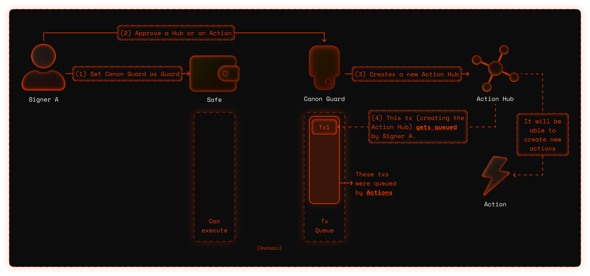
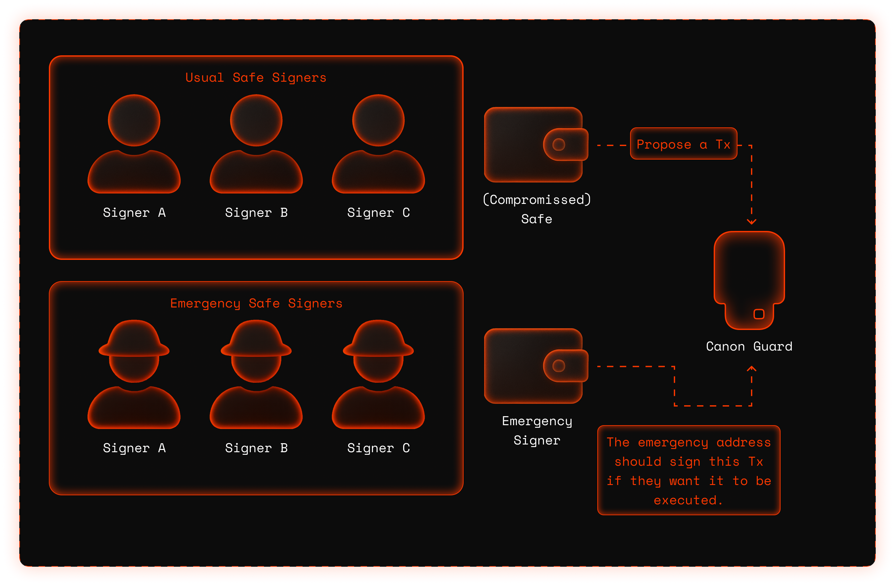

## Context

For most organizations, Safe is the right choice and works beautifully. Then comes the week you move eight figures and suddenly good UX isn’t the same as good risk. The assumptions that work for small DAOs (lightweight coordination, off‑chain convenience, human vigilance) start to creak under institutional weight.

<!-- ::: note Reference
If this is the first time you hear about Safe, check [Gnosis Safe]() and [Safe Guards]().
::: -->

When signatures and status live off‑chain, there’s a fog. A compromised frontend or coordination layer can make reality diverge from what signers see. You don’t notice until the threshold is met and the transaction sails through. [We’ve seen how that story can end.](https://rekt.news/not-so-safe)

At scale, the five dollar wrench stops being a meme and becomes an operating assumption. If multiple signers are pressured at the same time, the “independent, freely acting signer” model breaks. Maybe temporarily, but long enough to matter. 

And even without drama, cognitive fatigue is a thing. After the fiftieth recurring transfer, even meticulous reviewers skim. That’s fine when the stakes are low, it’s risky when they aren’t.

Canon Guard is the answer we wanted: keep the Safe, keep the habits, remove the blind spots. 

## Canon Guard

Imagine it’s a regular Tuesday. Ops needs to move funds, the clock is ticking, and everyone’s juggling ten other things. In the usual Safe flow, you craft a transaction, collect signatures somewhere off-chain, and hope the frontend shows everyone the same truth. It’s fine until the day it isn’t.

Canon Guard changes the rhythm without changing the band. You still use your Safe. Owners still approve. But instead of pushing opaque blobs around, you point at an onchain **action**: a small contract whose only job is to say, clearly and immutably, **“here’s what we’ll execute”**. You queue that action. It sits onchain, locked in amber, easy to simulate, visible to all. Signers approve the exact Safe hash onchain. When the clock says go, anyone can execute.

Routine moves don’t need to feel heavy. For things you do every week you pre‑approve trusted **action builders** (or whole **hubs** that mint specialized builders). Those skip the long wait and pass through a short delay. Ad‑hoc or novel moves still work, they just run on a longer fuse, so you have time to look twice.

And if the worst day shows up there’s a big red switch called emergency mode. Flip it, and execution authority narrows to a higher‑security caller. Owners can still propose and approve, but nothing moves unless the emergency caller decides it should. The system stalls in the safest possible way.

As a summary, what changes here is that:

- Approvals are onchain, where everyone can see them.
- Payloads are immutable once queued, so what you simulate is what will run.
- Time does a lot of the security work: short delays for pre‑approved, long delays for everything else.
- When in doubt, you can always spend a Safe nonce with a no‑op to clear stale signatures.

Canon Guard makes the default path safer without slowing the happy path. In the [Concepts section](./concepts/canon-in-a-nutshell.md), we’ll get technical: components, timelocks, hubs vs builders, emergency controls. If you are willing to try it out, go directly to [Getting Started](./getting-started/getting-started.md). 

**For now, remember: actions are addresses, approvals are onchain, time is your ally.**