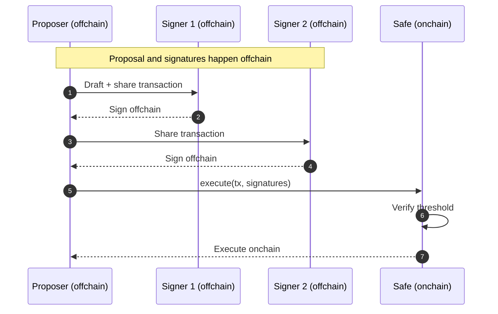
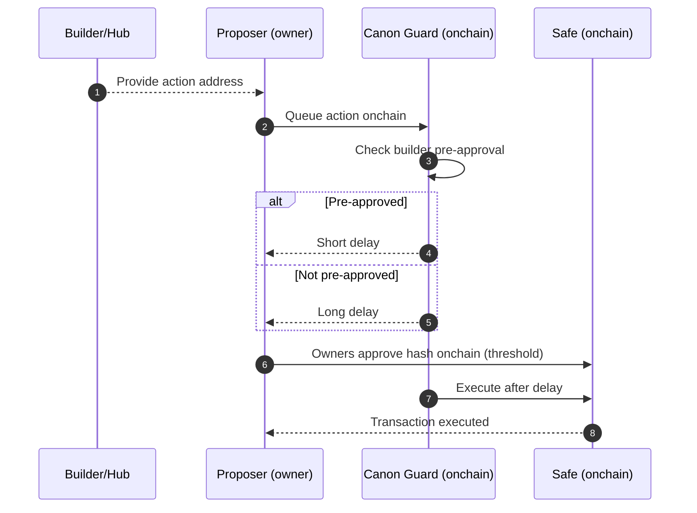

Safe proposals and signatures are gathered offchain. Once enough offchain signatures are collected to reach the threshold, anyone can submit the transaction and signatures onchain for execution. This flow is efficient, but it creates a visibility gap: payloads can change or be misrepresented offchain, individual signers might see slightly different views, and stale signatures can linger. The result is great UX with some operational blind spots when stakes are high.

```mermaid
sequenceDiagram
  autonumber
  %% Offchain proposal and signatures
  participant P as Proposer (offchain)
  participant S1 as Signer 1 (offchain)
  participant S2 as Signer 2 (offchain)
  %% Onchain execution
  participant Safe as Safe (onchain)

  Note over P,S2: Proposal and signatures happen offchain
  P->>S1: Draft + share transaction
  S1-->>P: Sign offchain
  P->>S2: Share transaction
  S2-->>P: Sign offchain
  P->>Safe: execute(tx, signatures)
  Safe->>Safe: Verify threshold
  Safe-->>P: Execute onchain
```

## What Canon Guard changes

Canon Guard keeps your Safe but moves intent onchain. Instead of passing offchain blobs around, you reference an onchain action that encodes exactly what will be executed. Owners approve the Safe hash onchain against this payload. Time‑based delays then separate routine activity from novel changes.

### Actions

An action is a minimal onchain contract that encodes the exact Safe call data and value to be executed. Because it is an address with immutable contents, anyone can simulate it and verify that approvals match the precise payload that will run. Actions are queued onchain and later executed through the Safe.

<!-- ### Action builders and hubs

An action builder is a contract that deploys actions with a predefined structure (for example, a single ERC‑20 transfer or a known sequence of calls). Teams can pre‑approve specific builders, or whole hubs that mint families of specialized builders. Pre‑approvals make routine tasks fast while keeping their shape constrained and reviewable. -->

### Short vs long paths

Proposals originating from pre‑approved actions follow a short delay before they become executable. Everything else follows a longer delay. This split reduces signer fatigue: recurring, low‑variance operations clear quickly; novel or higher‑risk operations deliberately take longer, giving reviewers time and space to look carefully.

### Emergency mode

When emergency mode is enabled, owners can still propose and approve actions, but execution is restricted to a designated emergency caller. This narrows authority at the final step so outflows pause safely while investigation or coordination happens. Normal execution resumes when emergency mode is turned off.

### Why onchain approvals

- Shared source of truth: everyone reviews the same immutable payload.
- Easy simulation: actions are addresses you can fork‑simulate and diff.
- Clear audit trail: proposals, approvals, and execution are recorded onchain.
- Safer operations: time delays and explicit pre‑approvals make intent legible and harder to spoof.

```mermaid
sequenceDiagram
  autonumber
  participant H as Builder/Hub
  participant P as Proposer (owner)
  participant CG as Canon Guard (onchain)
  participant Safe as Safe (onchain)

  H-->>P: Provide action address
  P->>CG: Queue action onchain
  CG->>CG: Check builder pre-approval
  alt Pre-approved
    CG-->>P: Short delay
  else Not pre-approved
    CG-->>P: Long delay
  end
  P->>Safe: Owners approve hash onchain (threshold)
  CG->>Safe: Execute after delay
  Safe-->>P: Transaction executed
```

In the [Concepts](./concepts/canon-in-a-nutshell.md) section, you’ll find details on components, timelocks, hubs vs builders, and emergency controls. For practical steps, see [Getting Started](./getting-started/getting-started.md).