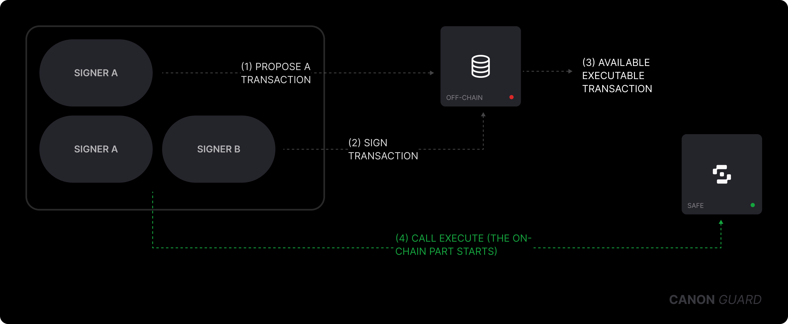
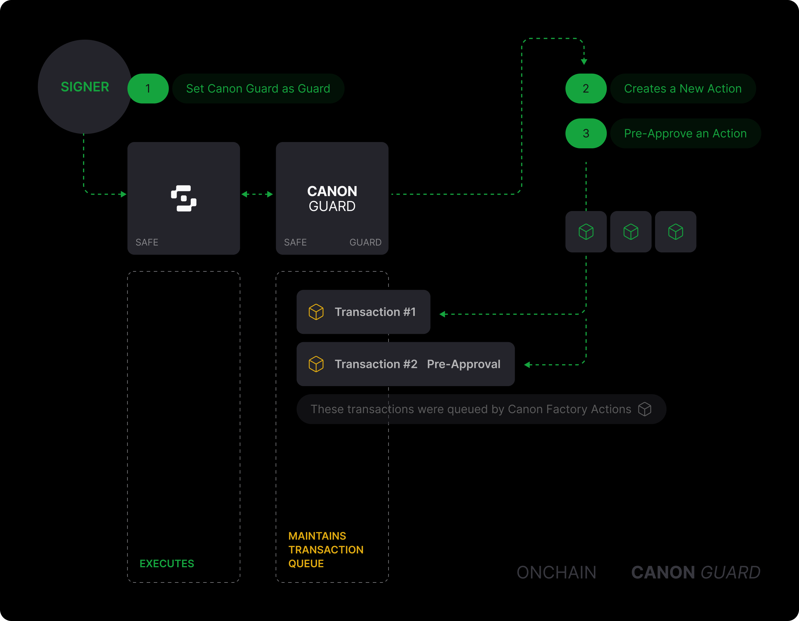
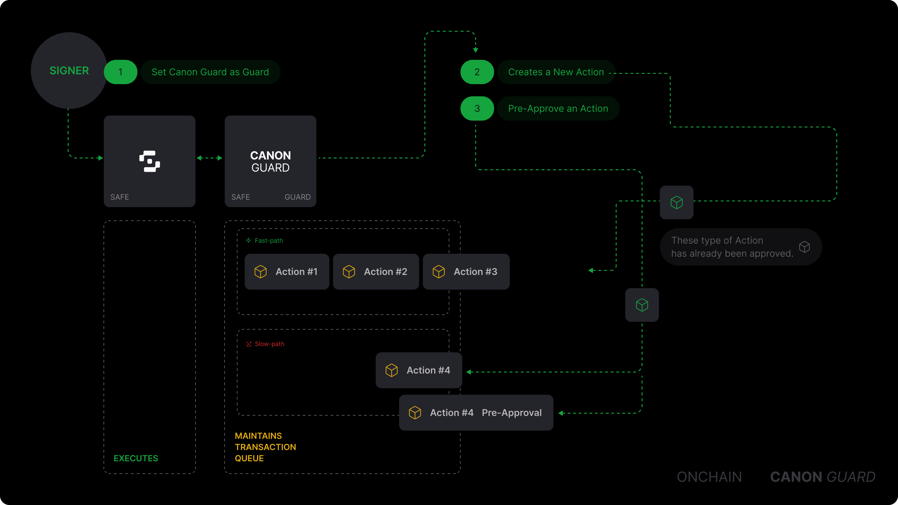
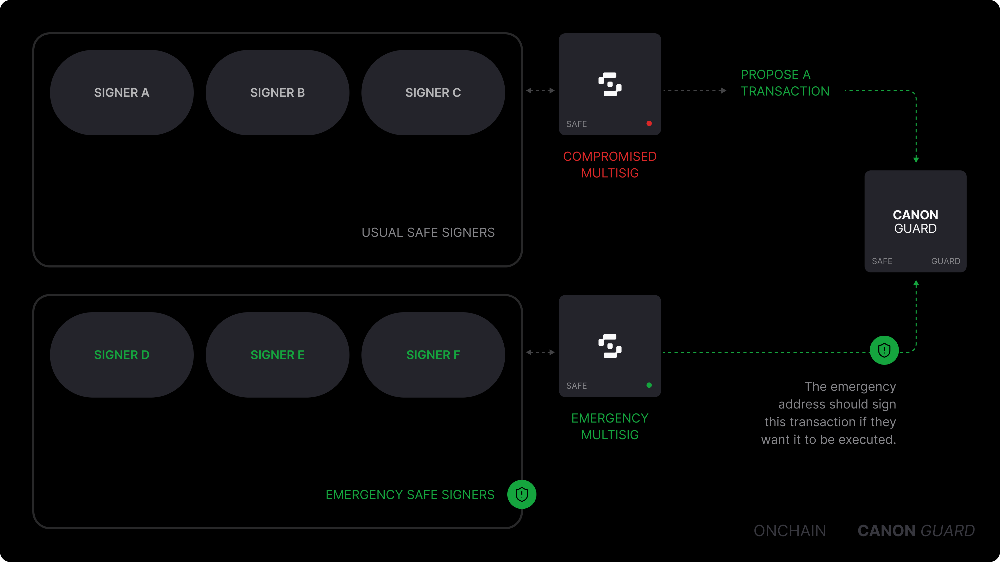

Safe transaction proposals and signatures are gathered off-chain. Once enough off-chain signatures are collected to reach the threshold, anyone can submit the transaction and signatures on-chain for execution. This flow is efficient (and might work for certain cases), but it creates a gap: payloads can change or be misrepresented off-chain, individual signers might see slightly different views, and stale signatures can linger. The result is great UX with some operational blind spots when stakes are high.



## What Canon Guard changes

Canon Guard keeps your Safe secure by moving intent on-chain. Instead of passing off-chain blobs, you reference an on-chain **action** that precisely encodes what will be executed. Owners approve the Safe hash on-chain against this payload, ensuring that what you simulate is exactly what gets executed. Routine transactions are **pre-approved**, taking the short path, while new transactions that aren't pre-approved follow the long path, reducing signer fatigue.



### Actions

An action is a minimal on-chain contract that encodes the exact Safe call data and value to be executed. Because it is an address with immutable contents, anyone can simulate it and verify that approvals match the precise payload that will run. Actions are queued on-chain and later executed through the Safe. 

For example, sending 0.1 ETH to `vitalik.eth` is a one‑action builder and follows the same `queue → approve → execute` flow:

```solidity
ISimpleActions.SimpleAction[] memory txs = new ISimpleActions.SimpleAction[](1);
txs[0] = ISimpleActions.SimpleAction(
    {
        target: 0xd8dA6BF26964aF9D7eEd9e03E53415D37aA96045, 
        signature: "",  
        data: hex"",
        value: 0.1 ether
    });
address builder = simpleActionsFactory.createSimpleActions(txs);
canonGuard.queueTransaction(builder); // Propose
SAFE.approveHash(canonGuard.getSafeTransactionHash(builder)); // Approve on-chain
canonGuard.executeTransaction(builder); // Execute after delay
```

### Short vs long paths

Proposals originating from pre‑approved actions follow a short delay before they become executable. Everything else follows a longer delay. This split reduces signer fatigue: recurring, low‑variance operations clear quickly; novel or higher‑risk operations deliberately take longer, giving reviewers time and space to look carefully.



### Emergency mode

When emergency mode is enabled, owners can still propose and approve actions, but execution is restricted to a designated emergency caller. This narrows authority at the final step so outflows pause safely while investigation or coordination happens. Normal execution resumes when emergency mode is turned off.



### Why on-chain approvals

- Shared source of truth: everyone reviews the same immutable payload.
- Easy simulation: actions are addresses you can fork‑simulate and diff.
- Clear audit trail: proposals, approvals, and execution are recorded on-chain.
- Safer operations: time delays and explicit pre‑approvals make intent legible and harder to spoof.

In the [Concepts](./concepts/canon-in-a-nutshell.md) section, you’ll find details on components, timelocks, hubs vs builders, and emergency controls. For practical steps, see [Getting Started](./getting-started/getting-started.md).